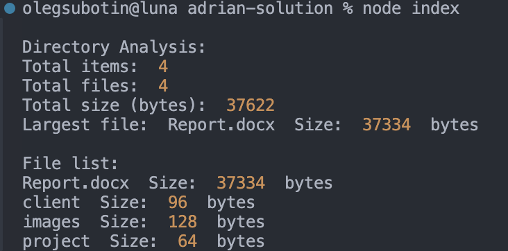

## Code Explanation

### `directoryAnalysis(fileStats)`

This function analyzes a collection of file stats and provides a summary:

- **Input**: An array of objects, each containing the file name and its stats (including size).
- **Output**: Logs the total number of items, the number of files (excluding zero-size files), the total size of files, and the largest file.

### `fileList(fileStats)`

This function prints out a list of all files and their sizes:

- **Input**: The same array of file stats.
- **Output**: Logs the file names and sizes.

### `processDirectoryContents(directoryPath)`

This is the core function that processes a directory:

- **Input**: The path to the directory.
- **Output**: Reads the directory, gathers stats for each item, and calls `directoryAnalysis()` and `fileList()` to log the results.

## Suggested Improvements

While the code works, there are several improvements that can be made to enhance the functionality and robustness:

### 1. **Handling Zero-Size Files**

- **Current issue**: The code excludes files with a size of `0` from the total file count.
- **Improvement**: It is recommended to include all files in the count, as zero-size files can still be valid and meaningful. Excluding them may misrepresent the actual file count.

Suggested change in the `directoryAnalysis()` function:

```javascript
let totalFiles = fileStats.length; // Count all files, even if size is zero
```

### 2. **`for...in` Loop for Arrays**

- **Current issue**: The code uses a `for...in` loop to iterate over arrays, which is not ideal. `for...in` is intended for iterating over object properties and may lead to unexpected results when used with arrays.
- **Improvement**: Replace `for...in` with `for...of` or `.forEach()` to properly iterate over array elements.

Suggested change:

```javascript
for (let fileStat of fileStats) {
  console.log(fileStat.name, " Size: ", fileStat.stats.size, " bytes");
}
```

### 3. **Cross-Platform Path Handling**

- **Current issue**: The code uses hardcoded `/` as the directory separator, which can cause issues on Windows (where the separator is `\`).
- **Improvement**: Use `path.join()` to ensure compatibility across different operating systems.

Suggested change:

```javascript
const filePath = path.join(directoryPath, file);
```

### 4. **Handling Subdirectories**

- **Current issue**: The code currently processes only the top-level files in a directory. Subdirectories are not inspected.
- **Improvement**: Implement recursion to handle nested directories. This can be done by checking if an item is a directory and calling `processDirectoryContents()` recursively.

Suggested change (pseudocode):

```javascript
if (stats.isDirectory()) {
  await processDirectoryContents(filePath); // Recursively analyze subdirectories
}
```

### 5. **Improve Error Handling**

- **Current issue**: While the code logs errors, there could be more detailed error handling, such as distinguishing between file permission errors, missing files, etc.
- **Improvement**: Add more specific error handling based on error types or codes to give better feedback to the user.

Suggested enhancement:

```javascript
catch (err) {
  if (err.code === 'ENOENT') {
    console.error('Directory not found:', directoryPath);
  } else {
    console.error('Error processing directory contents:', err.message);
  }
}
```

### Example Output


