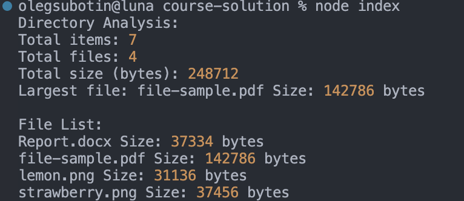

## Code Explanation

### `getStats(filePath)`

This function retrieves the file or directory statistics using `fs.stat()`:

- **Input**: A path to a file or directory.
- **Output**: The stats object containing information about the file, such as its size. If an error occurs (e.g., the file doesn't exist), it returns `null` and logs the error.

### `analyzeFile(filePath)`

This function analyzes an individual file:

- **Input**: A file path.
- **Output**: An object containing the file name and its size. It returns `null` if the file stats cannot be retrieved.

### `analyzeDirectory(directoryPath)`

This is the core function that recursively analyzes the directory and its contents:

- **Input**: A directory path.
- **Output**: An object containing:
  - `totalItems`: The total number of items (files and directories) within the directory.
  - `totalFiles`: The total number of files.
  - `totalSize`: The total size of all files combined.
  - `largestFile`: An object representing the largest file found (name and size).
  - `fileList`: A list of all files with their sizes.

The function iterates over all items in the directory:

- If the item is a file, it adds its size to the total size and checks if it's the largest file.
- If the item is a directory, it recursively analyzes the subdirectory and adds the results to the current directory's stats.

### `main()`

This function is the entry point of the application:

- It defines the directory to be analyzed (`./docs` by default).
- It calls the `analyzeDirectory()` function to analyze the contents of the directory.
- It prints the results, including the total number of items, files, total size, the largest file, and a list of all files with their sizes.

### Example Output

